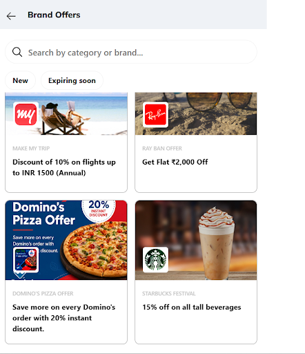
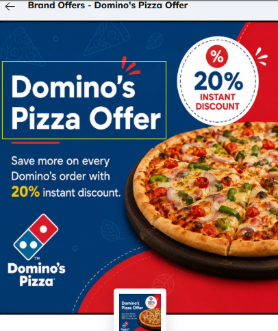
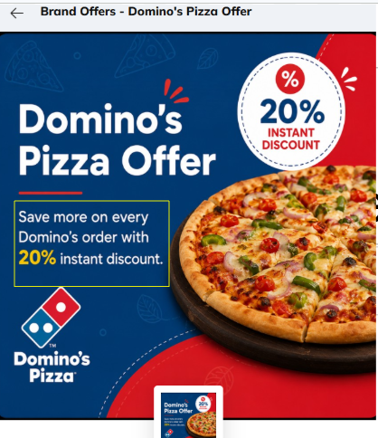

# Offer Management System (OMS) Documentation

# Merchant Offer

## Domino's Pizza Offer

This document explains how to configure the **Domino's Pizza Offer** in the Offer Management System (OMS).

---

## 1. Label

**(Categorize offers by travel, food, beauty)**

Create a new label or choose an existing label from the dropdown.

---

## 2. Display Title

**(Title of the Offer to be shown to the customer in PWA)**

The Display Title is shown on the **Offer Details** page after the customer selects the offer from the PWA. It serves as the main heading of the merchant offer and helps customers quickly identify the available benefit.

### Display Title Value

**Domino's Pizza Offer**

---

## 3. Display Description

**(Description of the Offer to be shown to the customer in PWA)**

The Display Description appears below the Display Title on the **Offer Details** page. It briefly explains the offer so customers understand the benefit before making a purchase.

### Display Description Value

**Save more on every Domino's order with a 20% instant discount.**

---

## 4. Display Order

**(Prioritize display order)**

The Display Order determines the priority in which merchant offers are displayed. Offers with a lower display order appear before offers with a higher display order.

---

## 5. How It Works

1. Visit a participating Domino's store or order online.
2. Select your favorite pizza or meal.
3. Pay using your eligible card.
4. Get an **instant 20% discount** on your eligible order at checkout.

---

## 6. Terms and Conditions

- Valid on eligible Domino's orders only.
- Enjoy a **20% instant discount** using your eligible card.
- This offer cannot be combined with other promotions unless specified.
- Standard terms and conditions apply.
